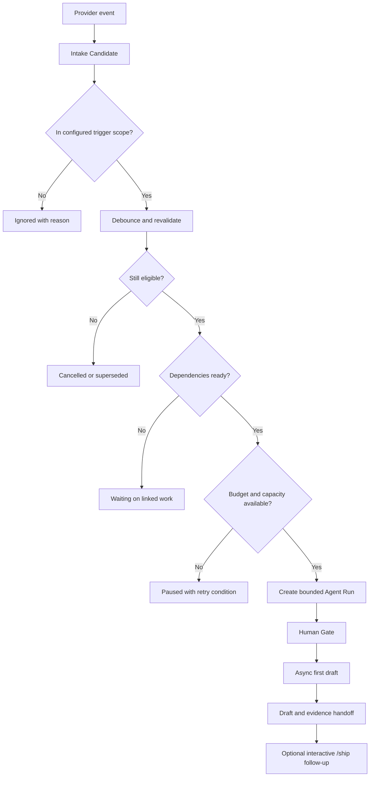

# Intake Trigger and Scope Policy

Status: design draft.

This document defines when a work item may enter the Agent Operations Console first-pass workflow.
It exists to prevent wasted agent runs for backlog work that may be reprioritized, linked to unfinished work, or deleted before anyone needs an implementation.

The policy is intentionally broader than one webhook handler.
It covers sprint scope, support work, linked tickets, epics, backlog imports, ticket mutation, deletion, duplicate events, model budgets, and operator overrides.

## Decisions captured so far

The default delivery profile considers only tickets in the current sprint or the immediately following sprint.
A ticket in an older or unscheduled backlog does not automatically create an Agent Run.

A production-support profile may trigger sooner when a ticket is created directly into the active sprint or enters an explicitly approved ready state.
That profile still requires the same project, repository, ticket-class, permission, budget, and human-gate checks.

The first paid pilot measures three to five real tickets as evidence of repeatability.
That is a validation sample, not a product-wide limit on how many tickets the system can process.

The first paid pilot uses a current-sprint-only intake profile.
Current-sprint membership is sufficient readiness for that pilot, so a separate `agent-ready` label is not required by default.

The pilot may observe every current-sprint work item, including code, documentation, wiki, and investigation work.
Intake scope is deliberately broader than code generation; the selected output route and available capability determine whether the candidate proceeds or pauses.

An investigation candidate produces a concise evidence-linked report and, when an explicitly selected wiki connection exists, a companion wiki draft.
The report is available for fast engineer review and trace drill-down; the wiki draft requires an operator approval before publication.

Jira label write-back is an optional later paid-support customization, not the authority to run work.
It is not part of the simple initial product; a later paid support profile may add an informational candidate or pause label after creating the candidate, but it must not use its own label as a second trigger.

An external event first creates an Intake Candidate.
It does not create a branch, worktree, agent process, model call, or repository side effect until the candidate passes revalidation.

## Trigger profiles

### First paid pilot

This is the bounded profile for the first real customer pilot.

- A work item is eligible for candidate creation only when it is assigned to the current sprint.
- The profile is ticket-type agnostic at intake: code, documentation, wiki, and investigation work may all create candidates.
- The candidate selects an output route and checks the required capability before any repository, model, or external-document side effect.
- A missing capability pauses the candidate with a visible reason; it does not turn a documentation ticket into a code run or silently broaden access.
- The pilot stays within one configured Jira project, the approved repository and selected wiki scope, the operator gate, and the workspace capacity limits.
- A ticket in the next sprint or unscheduled backlog remains outside this pilot profile even if it has an `agent-ready` label.

The initial product deliberately keeps this trigger simple; broader trigger customization is a later paid support option.

### Planned delivery

This is the default profile for ordinary product work.

- A ticket is eligible only when it is assigned to the current sprint or the immediately following sprint.
- The ticket must also satisfy the workspace project allowlist, repository allowlist, agreed ticket class, and explicit readiness rule.
- A ticket created in an unscheduled backlog remains outside automatic intake.
- A ticket assigned to a sprint later than the next sprint remains outside automatic intake until it moves into scope.
- A ticket that enters scope is queued for a short, configurable debounce and revalidation period before any side effect.

### Production support

This profile is for teams that place support tickets directly into the active sprint or an approved ready queue.

- A ticket may become eligible immediately after creation or transition into the approved ready state.
- The hook still re-reads the ticket before starting work and refuses deleted, closed, duplicated, superseded, or out-of-scope work.
- Production access is not implied by the profile.
The first pass remains restricted to the approved branch, environment, commands, and human gate.
- This profile must be enabled per workspace rather than inferred from a ticket label alone.

### Manual backlog catch-up

An operator may explicitly select a backlog ticket for a one-off run.

- Manual selection is an explicit override, not a reason to widen the automatic trigger window.
- The operator sees why the ticket is outside automatic scope and confirms the repository, branch, ticket class, and dependency state.
- The same preflight and human approval rules apply after selection.

### Disabled

The workspace can disable automatic intake while preserving existing run evidence.

New provider events are recorded as ignored or paused candidates without starting agent work.

## Readiness and label write-back

For the first paid pilot, current-sprint membership is the authoritative readiness signal.
The console should not require a separate Jira status or `agent-ready` label before creating an Intake Candidate.

The simple initial product does not write labels back to Jira.
A later paid support profile may enable a customer-named label write-back for visibility, such as a candidate-observed or candidate-paused label.
That write-back must be idempotent, permission-scoped, auditable, and applied only after the candidate exists.

The write-back label is metadata for people and Jira views, not permission to start work.
It must never be the only reason a candidate is created, and the console must not add a label that causes its own intake loop.

The paid customization surface remains intentionally open for later customers:

- the sprint window, including current-sprint-only or current-plus-next-sprint behavior;
- included work-item types and output routes, such as code, documentation, selected wiki pages, or investigation reports;
- optional Jira label write-back and the label names used;
- a production-support profile with its own ready-state rule;
- queue, concurrency, age, cost, and operator-approval limits.

These are paid support and customization choices, not part of the simple initial trigger or a promise that every customer receives every route.

## Candidate-first state flow

The provider event is not itself proof that work should begin.
The candidate is the durable explanation of what was observed, why it was or was not eligible, and what must be true before a run can start.

## Eligibility predicate

Automatic intake requires every applicable condition below:

- The workspace has automatic intake enabled for the relevant profile.
- The work-item project is allowed for the workspace.
- The ticket is in the allowed sprint window, unless a support or manual profile explicitly overrides that rule.
- The ticket satisfies the configured readiness rule: current-sprint membership for the first pilot, or a profile-specific status, label, or equivalent provider signal later.
- The ticket type and selected output route are included by the workspace profile, and the required capability is available.
- The repository resolves to an allowed repository and approved base branch.
- The ticket is not deleted, closed, cancelled, superseded, duplicated, or already represented by an active run for the same revision.
- Required acceptance criteria are present and readable.
- Blocking dependencies are resolved or explicitly overridden by an operator.
- Workspace concurrency and cost budgets have capacity.
- The required connection references and runner capabilities are available.

For the first pilot, sprint membership is sufficient to create a candidate but not sufficient to create an Agent Run.
The label-only rule in the current dry-run prototype is a local eligibility fixture, not the complete live policy.

## Customer situations and default behavior

| Situation | Default behavior | Reason and operator path |
| --- | --- | --- |
| A ticket is created in the unscheduled backlog. | Do not start automatic intake. | Backlog work may be deleted or reprioritized; the operator can select it manually when it becomes important. |
| A ticket is added to the current sprint. | Under the first-pilot profile, create an Intake Candidate and revalidate it after the debounce window. | Current-sprint membership is the pilot readiness signal; output route, capability, dependency, budget, and human-gate checks still control whether a run starts. |
| A ticket is added to the next sprint. | Create an Intake Candidate under the planned-delivery profile. | One sprint of look-ahead allows useful preparation without scanning the whole roadmap. |
| A ticket is assigned to a sprint later than the next sprint. | Do not start automatic intake. | The ticket is planned but not near enough to justify model and branch work. |
| A current-sprint ticket requests documentation or wiki work. | Create an Intake Candidate and route it to the selected documentation capability; pause if the required wiki connection or permission is unavailable. | Non-code work can still benefit from an initial draft, but it must not be forced through a repository branch route. |
| A ticket outside the first-pilot current sprint has an `agent-ready` label. | Keep it outside automatic intake. | A label alone must not bypass the pilot's sprint boundary. |
| A later paid support profile enables label write-back. | Add the configured informational candidate or pause label after candidate creation, without using that label as a trigger. | The customer gets Jira visibility without changing the simple initial trigger or creating an automation loop. |
| A current-sprint ticket requests investigation work. | Create an Intake Candidate, produce a concise evidence-linked investigation report with trace drill-down, and create a companion wiki draft when an explicitly selected wiki connection exists. | Engineers can scan the findings quickly while retaining access to the full research trace and a durable documentation draft. |
| A support ticket is created directly in the active sprint. | Use the production-support profile if the workspace enabled it. | Support teams may need immediate preparation, but the profile must be explicit and bounded. |
| A ticket enters the sprint and is immediately deleted. | Cancel the candidate before any side effect and retain only minimal audit metadata. | Deletion is a normal lifecycle event, not an agent failure. |
| A ticket leaves the current or next sprint while queued. | Mark the candidate out of scope and do not create a run. | Reprioritization should not consume model or repository capacity. |
| A ticket leaves scope after a run has started. | Pause or cancel before the next side effect and mark the draft stale. | Existing work must not silently continue against a changed planning decision. |
| A ticket is closed or cancelled while a draft is running. | Stop at the next safe cancellation check and require operator review for any resume. | Closed work should not keep generating changes. |
| A ticket is reopened after a completed run. | Create a new revision and candidate rather than mutating the old run. | Historical evidence must remain explainable and immutable. |
| A provider sends the same webhook more than once. | Deduplicate by provider event identity and ticket revision. | Retries from the provider must not create duplicate branches or runs. |
| Acceptance criteria change after a draft starts. | Mark the draft stale, preserve evidence, and require revalidation before continuing. | A draft built against old intent is not a valid handoff. |
| A ticket has a blocking dependency. | Keep it waiting until the dependency is resolved or an operator explicitly overrides it. | The system should not implement work whose required prerequisite is unavailable. |
| A ticket blocks other tickets. | Process the ticket itself if eligible; do not fan out automatically to every downstream ticket. | A relationship is not permission to create a backlog of work. |
| Two tickets are linked but have no blocking relationship. | Keep separate candidates and runs while recording the link. | Informational relationships should not cause context contamination or branch collisions. |
| A parent ticket or epic contains many child tickets. | Do not create one run per child automatically. Queue only eligible child tickets within scope and capacity. | Epic size is not an execution authorization. |
| Several linked tickets must be changed together. | Require an explicit grouped-work policy and one operator-approved execution boundary. | Grouping can be useful, but it changes branch, review, recovery, and rollback semantics. |
| An epic changes after child drafts exist. | Mark affected drafts as context-stale and revalidate the impacted candidates. | Shared goals and constraints can invalidate previously prepared work. |
| A bulk import adds 100 or more backlog tickets. | Record them as out-of-scope candidates without creating runs. | Import volume must not turn into unbounded model spend or branch creation. |
| A bulk sprint assignment makes many tickets eligible at once. | Admit candidates through the workspace queue, concurrency, output-route, and cost limits; do not create all runs immediately. | Current-sprint scope defines eligibility, while capacity controls prevent a thundering herd. |
| A ticket has no repository, branch policy, or readable acceptance criteria. | Pause before repository access and show the missing capability. | The system should not guess a code target or generate an unreviewable draft. |
| A ticket's repository is unavailable. | Pause the candidate and preserve the reason for operator recovery. | A missing repository is a blocked capability, not permission to choose another repository. |
| A ticket is moved between projects. | Re-evaluate project and repository allowlists before resuming. | Project movement may change ownership, permissions, and policy. |
| A sprint rolls over and the next sprint becomes current. | Re-evaluate existing candidates idempotently; do not create duplicates. | Calendar transitions should not multiply work. |
| A ticket is manually selected from the backlog. | Record the operator override and run the full preflight. | Manual urgency is valid, but it must remain visible in evidence. |
| Automatic intake is disabled for a workspace. | Record provider events without creating runs. | Pausing intake must be reversible and auditable. |

## Linked work and epic behavior

The first implementation should distinguish relationship awareness from shared context.

### Relationship awareness

The console should normalize linked-work metadata such as parent, child, blocks, is blocked by, duplicate, and relates.
The relationship is evidence for scheduling and review.
It is not permission to ingest the linked ticket's full description, comments, attachments, code, or private documents.

Blocking relationships gate a candidate.
Informational relationships are recorded without changing execution order.
Unknown or contradictory link types should pause only when the configured policy says they affect safety; otherwise they remain visible as unresolved relationship metadata.

### Epic-scale work

An epic is a planning boundary, not an automatic batch command.
The console should never fan out to every child ticket merely because an epic was created, updated, or moved into a sprint.

The default behavior is one bounded candidate and one bounded Agent Run per eligible child ticket.
The queue can admit multiple children over time, but only within workspace capacity, agreed ticket class, dependency order, and cost budget.

Epic-level shared context may later include an approved goal, constraints, glossary, decisions, and evidence references.
That context must be explicitly attached to a run and versioned so that a changed epic can mark child drafts stale.
It must not become an unrestricted crawl of the epic's history or all linked work.

Grouped execution of several linked tickets is a separate capability.
It needs an explicit operator boundary, dependency graph, branch strategy, evidence contract, failure recovery, and review unit before it should be implemented.

## Scale and cost controls

The trigger window prevents backlog waste, but it is not enough by itself.
The live policy also needs:

- a maximum number of queued candidates per workspace;
- a maximum number of active runs per workspace and repository;
- a maximum number of model-backed attempts in a time window;
- a maximum estimated cost per workspace and per ticket class;
- a maximum age for a candidate before revalidation;
- a cancellation path when a ticket becomes irrelevant;
- an operator-visible queue preview before bulk sprint changes admit many tickets;
- idempotency across provider retries, ticket revisions, sprint transitions, and process restarts;
- a clear difference between ignored, paused, cancelled, superseded, and completed candidates.

The ticket-type-agnostic first pilot makes the queue and route limits especially important.
A sprint assignment can contain code, documentation, and wiki work at the same time, so the system must cap work by output route as well as by repository and workspace.

The system should prefer a visible queue pause over silently downgrading quality or running work outside policy.
The asynchronous model route can be slower and cheaper, but it must still stop when the candidate is no longer valid.

The first paid pilot's three-to-five-ticket success sample should test repeatability across more than one ticket and at least one recovery.
It should not be mistaken for a hard limit on an epic, a sprint, or a future product workspace.

## Evidence requirements

Every candidate decision should explain:

- the provider event and ticket revision that created it;
- the trigger profile and sprint scope at evaluation time;
- the readiness signal and ticket class;
- the linked-work and dependency summary used for the decision;
- the repository and branch policy selected;
- the capacity and budget result;
- the reason for ignore, pause, cancellation, supersession, or run creation;
- the operator override, if any;
- the last revalidation time before a side effect.

An Agent Run should additionally record the first-draft contract already defined by the project:
branch and worktree, initial commits, acceptance-criteria mapping, checks and evidence, model and cost status, known gaps, recovery notes, and engineer handoff.

## Implementation boundary

This document is the implementation boundary for the next hook design.
It does not enable live Jira hooks or customer repository access by itself.

The current local prototype should remain synthetic and dry-run.
The next implementation should add normalized sprint, relationship, work-item-type, output-route, and optional label-write-back fields to the provider-neutral work-item shape, then introduce an Intake Candidate layer before changing `ingestJiraWebhook` into a live trigger.

The live hook should be implemented only after the provider adapter can distinguish ticket creation, sprint assignment, sprint removal, status changes, deletion or closure, link changes, and acceptance-criteria revisions.

The first live rollout should enable one workspace, one Jira project, one repository for code routes, selected wiki scope for documentation routes, an investigation-report route, the current-sprint-only pilot profile, and one operator-approved runner.

## Required future tests

- A backlog ticket creates no Agent Run under the planned-delivery profile.
- A current-sprint ticket creates one candidate and one run after successful revalidation.
- A current-sprint documentation or wiki ticket creates a candidate, selects the correct route, and pauses visibly when its capability is unavailable.
- A next-sprint ticket is eligible, while a later-sprint ticket is not.
- A ticket outside the first-pilot current sprint does not run solely because it has an `agent-ready` label.
- A later paid-support label write-back is idempotent and cannot create a self-triggering intake loop.
- A current-sprint investigation ticket produces a concise report with evidence links and trace drill-down.
- A current-sprint investigation ticket with a selected wiki connection produces a companion draft that cannot publish without operator approval.
- A support-profile ticket created directly in the active sprint is admitted only when the workspace profile is enabled.
- A deleted ticket is cancelled before branch or worktree creation.
- A ticket removed from scope while queued is cancelled without a model call.
- A closed ticket stops before the next side effect.
- A changed acceptance criterion makes an existing draft stale.
- A duplicated provider event does not create a second candidate or run.
- A blocking dependency holds a ticket while an informational link does not.
- An epic update does not fan out to every child ticket.
- A bulk sprint assignment respects queue, concurrency, and cost limits.
- A sprint rollover does not duplicate candidates.
- A manual backlog override records the operator and still runs preflight.
- A missing repository, branch policy, or acceptance criterion pauses with a recoverable reason.
- A cancelled workspace prevents new candidates and stops future side effects.

## Open decisions for discovery

- Whether support tickets may run without a sprint when they enter a dedicated ready queue.
- Whether grouped linked-ticket execution should ever be part of the first paid pilot.
- Which epic context fields are safe to inherit automatically, if any.
- The initial queue, concurrency, age, and cost limits for one pilot workspace.
- Whether a candidate is visible to customers as a waiting item or only to the operator during the founder-guided phase.
